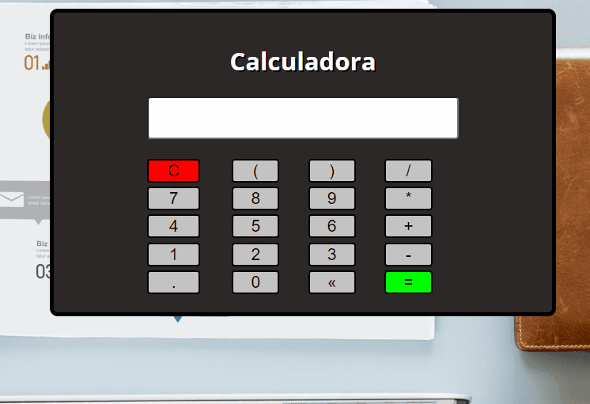

## Calculadora

<h3>✍️O que aprendi com este projeto ?</h3>

Pude trabalhar com factory functions e compreender melhor o seu uso, também optei por utilizar a função eval do JavaScript que é capaz de realizar as contas dispostas no display da calculadora. Foi um ótimo projeto para práticar funções e objetos e lembrar algumas práticas boas. Além disso pude converter este código usando construction function, o que deixou o código menor e mais limpo.

  
🔗[Clique aqui para acessar](https://pedrodevvv.github.io/Calculadora-JS/)
## 🛠️Tecnologias

* JavaScript
* HTML
* CSS
* Visual Studio Code

## 📞 Contato

📩E-mail: pedrohgs2004@gmail.com  
🌐Linkedin: https://www.linkedin.com/in/pedro-henrique-g-silva-a2100a23a/?originalSubdomain=br
